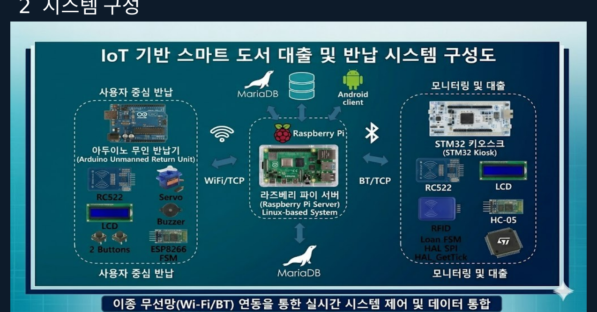
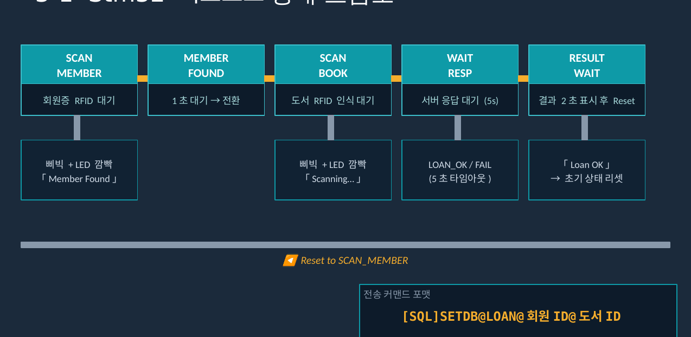
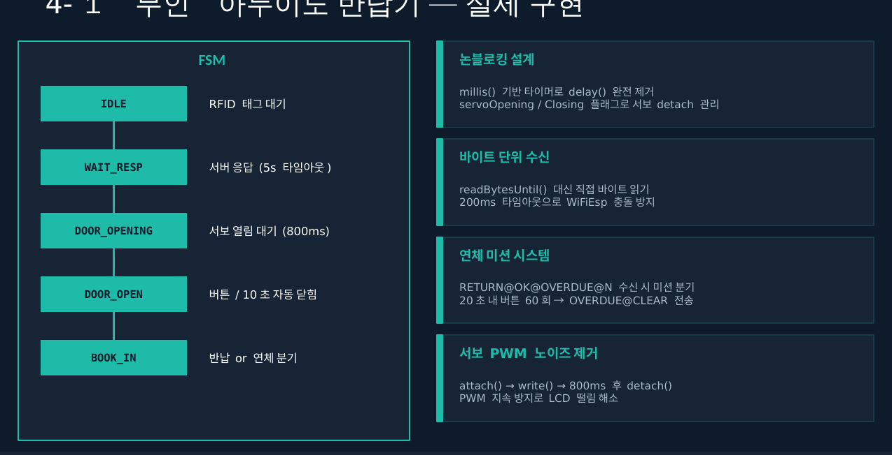

# IoT 기반 무인 도서 반납 키오스크

## 개요
RFID·IoT 기반 자동화로 도서 대출/반납 대기시간, 실시간 적재현황 파악 불가, 연체도서 관리 어려움 문제를 해결하기 위한 프로젝트입니다. STM32 키오스크(대출) - Arduino 무인 반납기(반납) - Raspberry Pi 게이트웨이 - MariaDB로 이어지는 3-Layer 임베디드 IoT 시스템을 구축했습니다.

- **수행기간**: 2026. 05. 26 ~ 06. 04
- **사용 기술**: STM32F4/L4(Cortex-M4), Arduino Uno, ESP8266(Wi-Fi), HC-06(Bluetooth), RC522(RFID/SPI), I2C CLCD, Raspberry Pi(C/Linux, pthread, select()), MariaDB, TCP Socket

## 담당 역할
RC522 SPI 통신, 서보모터 PWM 노이즈 등 트러블슈팅을 포함해 STM32 키오스크·Arduino 반납기 전반의 설계 및 통합 구현 참여

## 주요 구현 내용
### 3-Layer 시스템 구성
- **LAYER1(단말)**: STM32 키오스크(대출, RC522+CLCD+HC-06), Arduino 무인 반납기(반납, ESP8266+서보모터)
- **LAYER2(게이트웨이)**: Raspberry Pi가 pthread 멀티스레드 + select() I/O 다중화로 블루투스↔TCP 실시간 중계
- **LAYER3(서버/DB)**: MariaDB에서 도서/사용자 데이터 관리, SQL 커맨드 파싱 후 TCP 소켓으로 결과 피드백

### STM32 키오스크(대출) FSM
- SCAN_MEMBER → MEMBER_FOUND → SCAN_BOOK → WAIT_RESP(5초 타임아웃) → RESULT_WAIT(2초 표시 후 리셋) 구조
- RC522로 회원증·도서 태그 인식 후 서버로 대출 커맨드 전송

### Arduino 무인 반납기 - 논블로킹 FSM
- millis() 기반 타이머로 delay() 완전 제거
- IDLE → WAIT_RESP → DOOR_OPENING → DOOR_OPEN → BOOK_IN 흐름 설계
- 연체 도서 반납 시 20초 내 버튼 60회 입력 미션을 통과해야 반납되는 페널티 로직 구현
- 저비용 Arduino를 N대 병렬 배치 가능한 확장 구조로 설계

## 문제해결
- **RFID 리더기 SPI 통신 불가(Version 레지스터 0x00 출력)**: SPI Prescaler가 너무 낮아 RC522 최대 클럭을 초과하고, CS 핀이 초기화 시 LOW 상태로 통신이 충돌한 것이 원인 → SPI1 BaudRatePrescaler를 8로 변경하고 RC522_Init() 첫 줄에 CS_High() 호출을 추가해 해결
- **서보모터 동작 중 LCD 화면 흔들림**: 서보 위치 이동 후 제어신호를 끊지 않아 PWM이 지속 출력되며 노이즈를 유발한 것이 원인 → 문 열림/잠금 함수에 상태 변수를 두고 800ms 경과 확인 후 제어신호를 차단하도록 수정해 해결

## 회고
서보모터 PWM을 켜놓기만 하고 끄는 로직이 없어서 생긴 문제였는데, 겉으로는 LCD 화면 떨림이라는 전혀 다른 증상으로 나타나 원인 추적 과정 자체가 큰 공부가 되었습니다. 임베디드에서는 겉보기 증상과 실제 원인(클럭 속도, 핀 초기 상태)이 다른 경우가 많다는 것을 체감했습니다.
