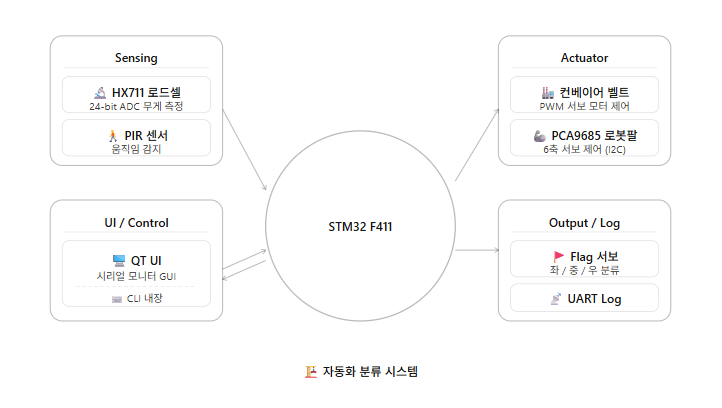
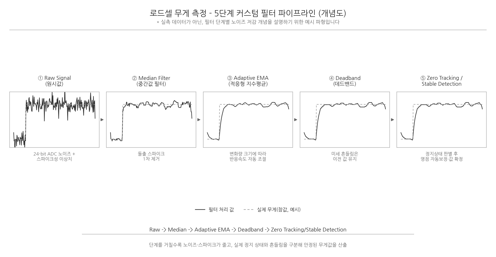

# 물류 자동 분류 시스템 (Weight-based Automatic Classification System)

## 개요
로드셀 센서로 물체 무게를 실시간 측정하고, 측정값에 따라 컨베이어 벨트 구동과 로봇팔 피킹(Picking) 동작을 유기적으로 제어하는 통합 자동화 시스템 프로젝트입니다. 센서 데이터 신뢰성 확보를 위한 필터링 알고리즘 적용과 팀 단위 형상관리(GitHub) 체계화를 함께 진행했습니다.

- **수행기간**: 정확한 기간 미기재 (GitHub 저장소 커밋 38건 기준)
- **사용 기술**: STM32 Nucleo F411RE, FreeRTOS, C/C++, Git/GitHub

## 담당 역할
HX711 로드셀 기반 무게 측정 및 커스텀 필터 파이프라인 설계(Median → Adaptive EMA → Deadband → Zero Tracking → Stable Detection), 로드셀 케이스 3D 설계(Bambu Studio)

## 주요 구현 내용

### 무게 측정 및 필터링 설계 (본인 담당)
- HX711 로드셀로 아날로그 무게 신호 수집 후 디지털 변환
- 단순 이동평균만으로는 노이즈·드리프트에 취약해, Median 필터 → Adaptive EMA → Deadband → Zero Tracking → Stable Detection으로 이어지는 5단계 커스텀 필터 파이프라인을 직접 설계해 측정 정밀도 향상
- 3D 프린팅(Bambu Studio)으로 로드셀 케이스를 설계해 반복 측정 시 발생하는 편차 저감

### 시스템 통합 (FreeRTOS 기반)
- Sensing(로드셀) → Processing(MCU 필터링/제어로직) → Acting(컨베이어 모터 + 6축 로봇팔) 3단 구조로 시스템 아키텍처 구성
- FreeRTOS 태스크 기반으로 무게 측정, 컨베이어 구동, 로봇팔 분류 시퀀스를 병렬 처리

### 팀 협업
헤더(.h)/소스(.c) 파일 분리로 모듈화, GitHub 기반 형상관리 및 주기적 코드 리뷰로 안정성 확보

## 회고
로드셀 원시값 자체는 노이즈가 심해서 단일 필터로는 안정된 무게값을 뽑기 어려웠는데, 필터를 단계별로 쌓아가며(중간값 → 지수평균 → 데드밴드 → 제로트래킹) 실제 정지 상태와 흔들림을 구분해내는 과정에서 신호처리 파이프라인 설계 감각을 키울 수 있었습니다.

---
※ 이 프로젝트는 발표자료(pptx) 없이 GitHub 저장소 기반으로 진행되어, 이 폴더에는 원본 소스 파일이 포함되어 있지 않습니다.
