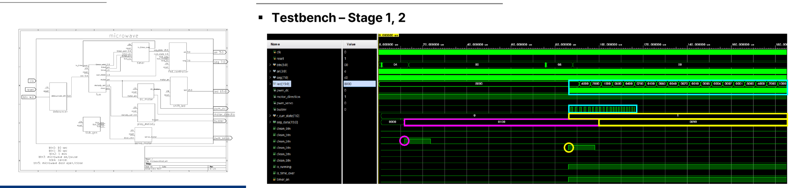
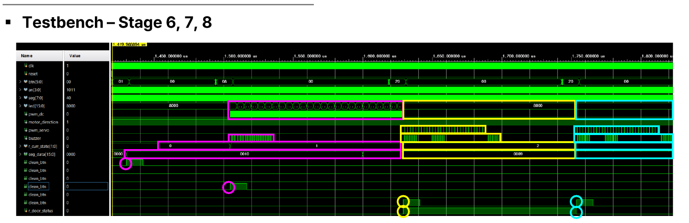

# FPGA 기반 임베디드 전자레인지 시스템 설계

## 개요
FSM 기반으로 전자레인지의 대기/조리/일시정지/완료 상태를 제어하고, DC·서보모터·부저·FND 등 이종 인터페이스를 통합해 PWM 정밀 구동 제어를 구현한 프로젝트입니다. 문 열림 감지 안전 로직과 버튼 디바운싱으로 시스템 신뢰성을 확보했습니다.

- **수행기간**: 2026. 02. 25 ~ 03. 02
- **사용 기술**: Verilog, Xilinx Vivado 2021.1, Xilinx Artix-7(Basys3)

## 담당 역할
FSM/타이머/모터 제어 로직 설계 및 통합 구현 참여

## 주요 구현 내용
### 시스템 설계 및 FSM 구성
IDLE/COOK/PAUSE/FINISH 4개 state로 구성된 FSM을 중심으로 timer, debouncer, fnd_controller, dc_motor, servo_motor, play_melody, shift_led 모듈을 통합했습니다.

### Testbench 검증
시간설정/시작-일시정지 반복/취소/문 열림 등 8단계 시나리오로 상태 천이 및 출력 동작을 검증했습니다.

## 문제해결
- **버튼 시간 설정 오류, 시작/정지 무한 반복**: 레벨 트리거 방식으로 버튼을 인식한 것이 원인 → 엣지 검출 코드를 추가해 0→1 변화 순간만 사용하도록 수정
- **PAUSE 상태에서도 timer가 계속 동작하는 꼬임**: FSM과 timer가 각각 독립적으로 상태를 관리한 것이 원인 → timer 독자 제어 로직을 삭제하고 FSM 신호(timer_en)로 강제 동기화
- **모듈 간 싱크 불일치(모터는 멈췄는데 소리는 계속)**: 각 동작부가 타이머 종료 신호를 개별 감지한 것이 원인 → 모든 입력/제어신호를 FSM 하나로 중앙화해 수정 범위 축소

## 회고
모듈별 독립 상태관리가 계속 싱크 오류로 이어져 결국 FSM으로 제어를 전부 중앙화했는데, 이 경험으로 "제어는 한 곳에서, 실행은 분산해서"라는 설계 원칙을 체감했습니다.
