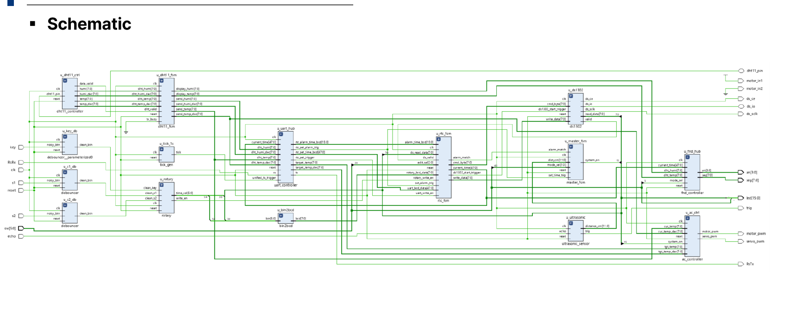
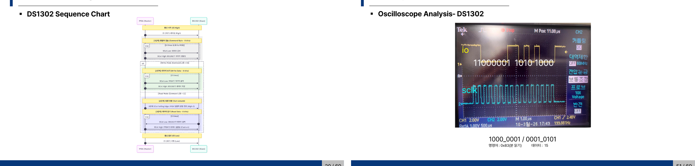

# FPGA 기반 스마트 공조기 시스템 설계

## 개요
FSM 기반으로 온습도 측정과 RTC(실시간 시계) 기반 알람/시간관리를 통합 제어하는 프로젝트입니다. DC·서보모터, DS1302 RTC, 초음파센서, FND 등을 통합 구동하고, UART·로터리 인코더 기반 시간 설정 기능을 구현했습니다.

- **수행기간**: 2026. 03. 04 ~ 03. 10
- **사용 기술**: Verilog, Xilinx Vivado 2021.1, Xilinx Artix-7(Basys3)

## 담당 역할
RTC(DS1302) 파트 담당: RTC FSM/DS1302 FSM 설계, DS1302 3-wire 통신(ds1302.v) 구현, UART·로터리 인코더 기반 시간설정 로직(rtc_fsm.v, rtc_data_parser.v) 구현

## 주요 구현 내용
### 전체 시스템 구성
Master/RTC/DS1302/DHT11 FSM으로 구성되며, RTC 시각과 설정 알람 시각이 일치하거나 초음파 센서가 사람을 감지하면 system_on 트리거로 모터가 구동됩니다.

### RTC(DS1302) FSM 설계 (본인 담당)
- RTC FSM: S_INIT → S_IDLE(UART/로터리/자동갱신 요청 대기) → S_READ/S_UART_WRITE/S_ROTARY_WRITE → S_WAIT → S_RELAX 7-state 구조로 통신 요청 우선순위(①PC 시간설정 ②로터리 인코더 ③자동갱신) 처리
- DS1302 FSM: IDLE → ACTIVE(SCLK 동기화 커맨드+데이터 송수신) → CE_HOLD → DONE 4-state로 3-wire(CE/IO/SCLK) 프로토콜 구현

### Oscilloscope 실측 검증 및 Testbench (본인 담당)
실제 보드에서 오실로스코프로 IO/SCLK 파형을 캡쳐해 0x83(분 읽기) 커맨드 응답을 직접 확인했습니다.

## 문제해결
- **DS1302 특정 비트에서 데이터가 깨지는 현상**: 데이터를 반 클럭 먼저 준비해 SCLK 하강 엣지 시점과 칩이 읽는 시점의 마진을 최적화해 해결
- **PC(UART)·로터리 인코더·자동갱신 3곳에서 동시에 들어오는 RTC 통신 요청 충돌 가능성**: rtc_fsm.v에서 우선순위를 두고 요청을 순차 처리하도록 설계

## 회고
DS1302는 SCLK 하강 엣지에 맞춰 정확한 타이밍으로 주고받아야 하는 칩이라, 오실로스코프로 실제 파형을 직접 찍어보고 나서야 데이터가 깨지는 원인을 확신할 수 있었습니다. 실측 검증의 중요성을 크게 느꼈습니다.
