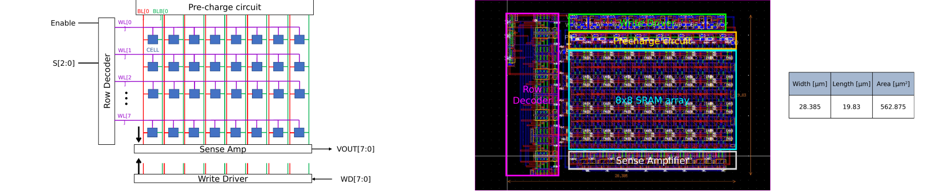
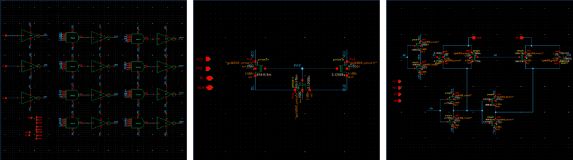

# 8x8 SRAM Design (SRAM unit cell & 64-bit SRAM 설계)

## 개요
GPDK 90nm 공정 기반으로 64-bit asynchronous SRAM의 schematic 및 layout을 설계한 프로젝트입니다. SRAM cell의 Standby/Read/Write 동작 원리를 이해하고, SNM(Static Noise Margin) 시뮬레이션을 통해 최적의 cell 사이즈를 결정한 뒤, 주변회로(Decoder, Pre-charge, Write Driver, Sense Amp)를 결합해 전체 8x8 SRAM을 완성했습니다.

- **수행기간**: 2025. 08. 29 ~ 09. 08
- **사용 기술**: Cadence Virtuoso, Spectre, ADE, Assura, GPDK 90nm

## 담당 역할
Decoder / Pre-charge circuit / Write driver 설계

## 주요 구현 내용
### SRAM 전체 구조 설계 및 최종 결과
- Row Decoder, 8x8 SRAM Cell Array, Pre-charge, Sense Amp, Write Driver로 구성된 64-bit block diagram 설계
- SNM 시뮬레이션 기반 cell 사이즈 결정 후 DRC 검증 완료 (Area 562.875㎛², 28.385 x 19.83㎛)

### 담당 서브블록 설계 (Decoder / Pre-charge / Write Driver)
- **3x8 Decoder**: Enable, S[2:0] 입력으로 8개 워드라인(WL[0:7]) 중 하나를 선택하는 디코딩 로직
- **Pre-charge circuit**: PMOS 기반으로 Read/Write 이전 BL/BLB를 VDD로 pre-charge
- **Write Driver**: 입력 데이터(WD)를 BL/BLB에 구동하여 SRAM cell에 write 수행

## 설계 고려사항 및 회고
Cell의 noise margin과 read/write 안정성은 pull-up/pull-down/access TR 비율에 따라 trade-off 관계여서, VTC curve 기반 SNM 시뮬레이션을 반복하며 TR 사이즈를 재조정했습니다. Cell 하나의 노이즈 마진 확보 문제가 주변회로 전체 사이즈 결정까지 연쇄적으로 영향을 준다는 것을 체감했고, 레이아웃 파라시틱 반영 후 재검증이 필요해 반복 검증의 중요성을 크게 느낀 프로젝트였습니다.
