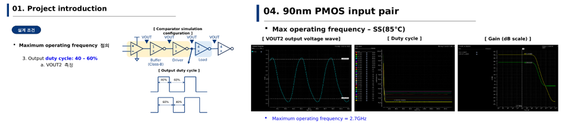
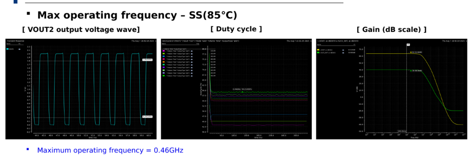

# Analog IC Project: 2-stage High-speed OP-AMP Comparator

## 개요
GPDK(90nm/180nm) 공정 기반으로 높은 최대 동작 주파수를 갖는 2-stage OP-AMP Comparator를 설계하고, Process/Input pair type(NMOS/PMOS)/Corner(SS/NN/FF) 변화에 따른 특성을 분석한 프로젝트입니다.

- **수행기간**: 2025. 07. 30 ~ 08. 08
- **사용 기술**: Cadence Virtuoso, Spectre, GPDK 90nm/180nm

## 담당 역할
90nm/180nm NMOS·PMOS Input pair 회로 설계 및 시뮬레이션 분석 참여

## 주요 구현 내용
### Maximum Operating Frequency 정의 및 시뮬레이션 조건
Saturation 동작, Output full-swing(90%/0~VDD), Duty cycle 40~60% 기준으로 최대 동작 주파수를 정의했습니다.

### Input Pair 설계 및 Corner별 특성 분석
90nm PMOS input pair 기준 SS(85℃)에서 Max operating frequency 2.7GHz, Gain 40.15dB를 확인했습니다.

## 설계 고려사항 및 회고
같은 회로라도 공정·입력쌍 종류에 따라 최대 동작 주파수 편차가 커서, 사양을 만족시키는 최적 조합을 찾는 데 반복 시뮬레이션이 필요했습니다. 동작 주파수와 duty cycle, gain을 동시에 만족시키는 조건을 찾는 과정에서 공정 corner별 마진 확보의 중요성을 체감했습니다.
