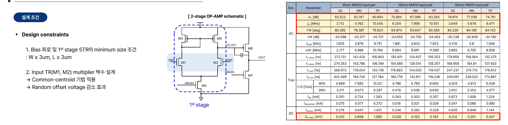
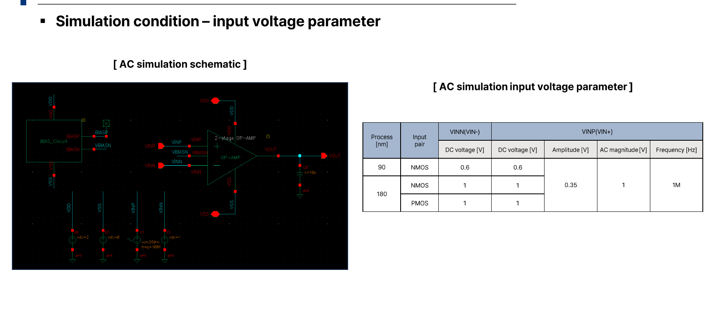

# Analog IC Project: 2-stage OP-AMP

## 개요
GPDK(90nm/180nm) 공정 기반, CL=10pF·1MHz 동작 조건에서 Gain(≥57dB)/Phase margin(≥60°)/Unity gain frequency(≥1MHz) 등 사양을 만족하는 2-stage OP-AMP를 설계하고, NMOS/PMOS Input pair 및 Process corner별 특성을 비교 분석한 프로젝트입니다.

- **수행기간**: 2025. 08. 20 ~ 09. 03
- **사용 기술**: Cadence Virtuoso, Spectre, GPDK 90nm/180nm

## 담당 역할
90nm/180nm NMOS·PMOS Input pair 회로 설계 및 Process corner별 특성 분석 참여

## 주요 구현 내용
### 2-stage OP-AMP 설계
1st stage 5TR(M1~M5) 최소 사이즈 조건(W≥3um, L≥3um)을 반영하고, Input TR(M1, M2)에 common-centroid 기법을 적용해 random offset voltage를 감소시켰습니다.

### Process/Input pair 조합별 사양 비교
90nm NMOS, 180nm NMOS, 180nm PMOS input pair 각각에 대해 SS/NN/FF corner별 Av, fu, PM 등 AC/DC/Transient 특성을 종합 정리했고, 모든 corner에서 설계 조건을 만족함을 확인했습니다.

## 설계 고려사항 및 회고
Phase margin과 Gain을 동시에 만족시키는 것이 trade-off 관계라, bias 조건을 조금만 바꿔도 스펙 전체가 흔들려서 균형점을 잡는 데 시간이 많이 필요했습니다. 공정이 scale down될수록 ro가 감소해 Av는 낮아지고 Vos는 커지는 경향을 실제 시뮬레이션으로 확인하며 공정-성능 관계를 체감했습니다.
