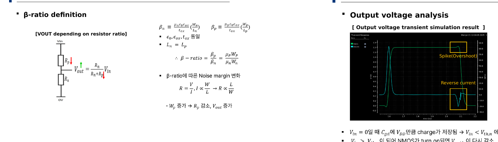
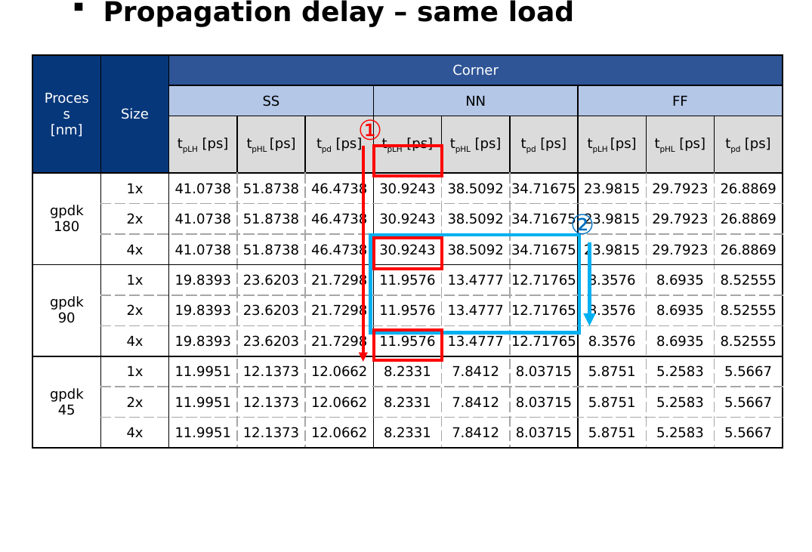

# Digital IC Project: Repeater Design & PPA Analysis

## 개요
Repeater를 설계하고 β-ratio, Rise/Fall time, Propagation delay, Duty cycle, Power consumption 등 PPA(Power·Performance·Area) 특성을 종합 분석한 프로젝트입니다.

- **수행기간**: 2025. 07. 10 ~ 07. 18
- **사용 기술**: Cadence Virtuoso, Spectre

## 담당 역할
Repeater 설계 및 PPA(전력·성능·면적) 특성 분석 참여

## 주요 구현 내용
### β-ratio 정의 및 Noise Margin 분석
βp/βn 비율에 따른 저항비 및 VOUT 변화 관계식을 도출하고, W/L 조정에 따른 noise margin 변화를 분석했습니다.

### Power Consumption 분석
Output voltage transient 시뮬레이션에서 Spike(overshoot) 및 reverse current 현상을 관찰하고 원인을 분석했습니다.

### Propagation Delay 종합 분석
gpdk180/90/45 공정, Multiplier(1x/2x/4x) 조합별 tpLH/tpHL/tpd를 SS/NN/FF corner에서 종합 비교했습니다.

## 설계 고려사항 및 회고
트랜지스터 사이즈(β-ratio) 하나를 바꿀 때마다 속도-전력-면적이 함께 움직여서, 디지털 회로도 결국 아날로그적인 트레이드오프 감각이 필요하다는 것을 느꼈습니다. Output spike가 reverse current를 유발하는 메커니즘을 직접 파형으로 확인하며 회로 동작 원인 분석 능력을 기를 수 있었습니다.
