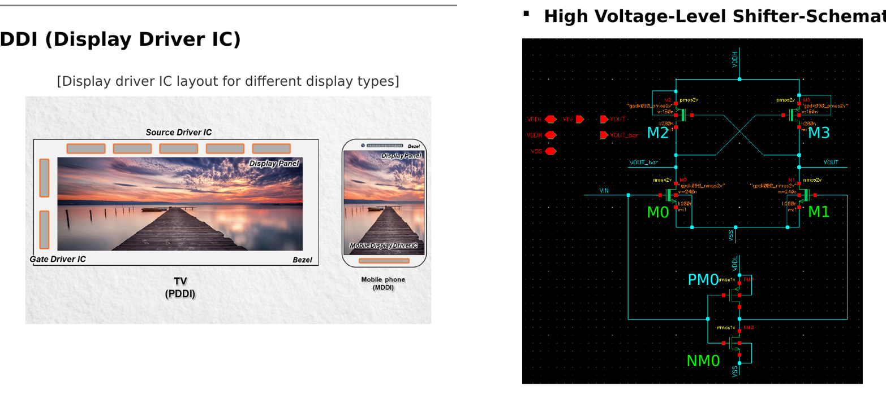
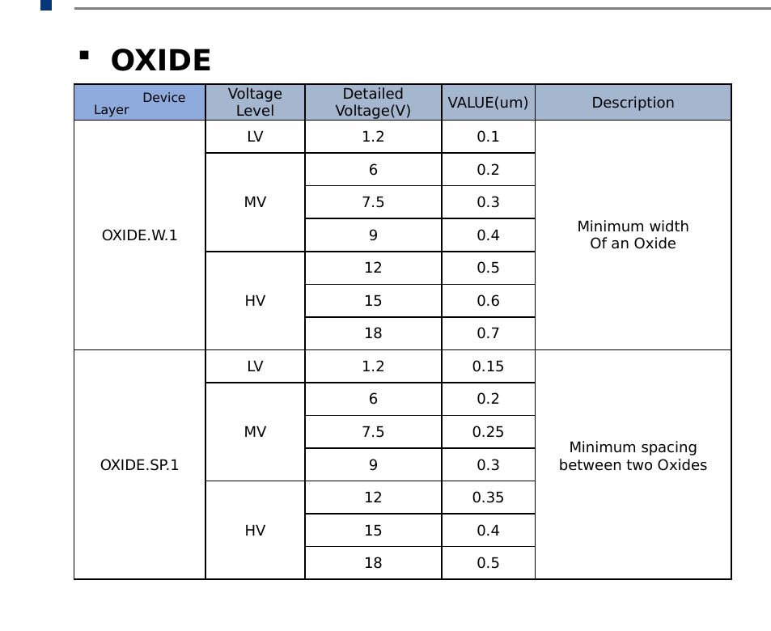

# Large Panel Source Drive IC (PPDI): Design Rules & Layout

## 개요
Display Panel 및 Source Drive IC의 구성요소·구동방식을 분석하고, DDI(Display Driver IC) 회로 블록의 동작을 이해한 뒤 Design Rule Guide를 작성한 프로젝트입니다.

- **수행기간**: 2025. 07. 21 ~ 07. 28
- **사용 기술**: Cadence Virtuoso (Layout/DRC 환경)

## 담당 역할
Source Drive IC 회로 블록(High Voltage-Level Shifter 등) 분석 및 Design Rule 작성 참여

## 주요 구현 내용
### Display Panel 및 DDI 구성 분석
PDDI(90nm, 태블릿/모니터/TV용)와 MDDI(22nm, 스마트폰용) 구조를 비교했습니다.

### Source Drive IC 회로 블록 분석 (High Voltage-Level Shifter)
저전압(1.8~3.3V)을 고전압(10~15V)으로 변환하는 Cross-coupled PMOS 기반 Level shifter의 동작 원리를 분석했습니다.

### Design Rule Guide 작성
OXIDE Layer 등 Device Layer별 Width/Spacing 규정을 정리했습니다.

## 설계 고려사항 및 회고
저전압을 고전압으로 바꿔주는 Level shifter 구조가 단순한 로직 같으면서도 실제 레이아웃에서 지켜야 할 design rule이 많아, 회로 이해와 공정 룰을 함께 봐야 하는 프로젝트였습니다.
