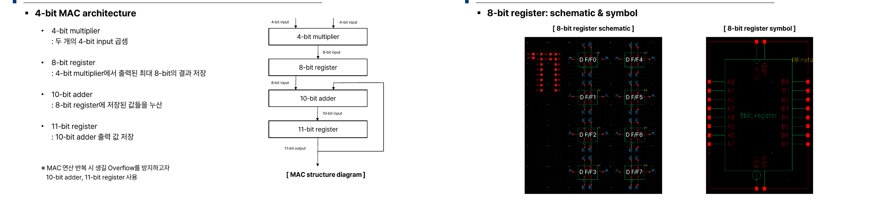
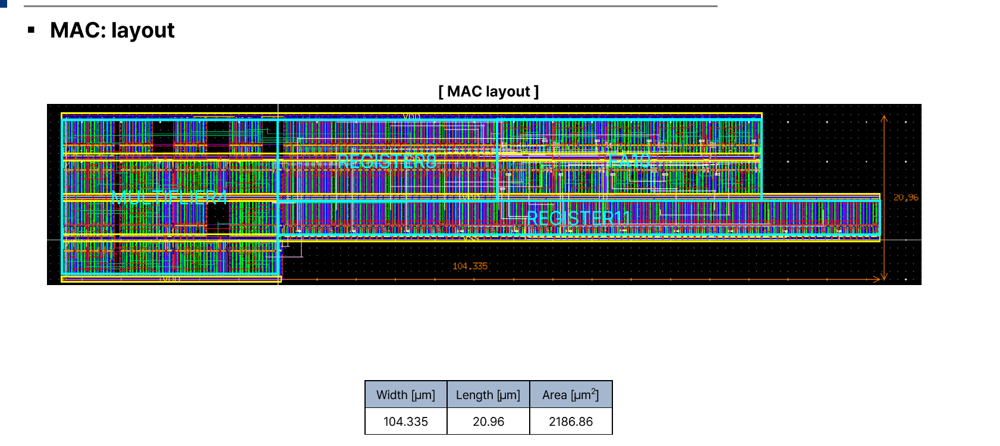

# Full Customed Digital IC Project: MAC (Multiply-Accumulate) Unit

## 개요
4-bit MAC unit을 구성하는 하위 블록(10-bit Adder, 8/11-bit Register, 4-bit Multiplier)의 schematic/layout을 설계하고, Top-level integration 및 면적 최적화, 동작 시뮬레이션 검증까지 수행한 Full-custom Digital IC 프로젝트입니다.

- **수행기간**: 2025. 07. 30 ~ 08. 11
- **사용 기술**: Cadence Virtuoso, Spectre (Full-custom Digital IC)

## 담당 역할
8-bit Register, 11-bit Register 설계

## 주요 구현 내용
### MAC 구조 설계
4-bit Multiplier → 8-bit Register → 10-bit Adder → 11-bit Register로 이어지는 구조로 overflow를 방지하고 accumulate 연산 latency를 최소화했습니다.

### Register 설계 (본인 담당)
D Flip-Flop 8개/11개를 병렬 배치한 8-bit/11-bit register schematic 및 symbol을 설계했습니다.

### 최종 결과
MAC 최종 layout을 완성했습니다 (Width 104.335㎛ x Length 20.96㎛, Area 2186.86㎛²).

## 설계 고려사항 및 회고
서브블록 4개를 각자 나눠 설계하다 보니 인터페이스 타이밍을 맞추는 top-level integration 단계에서 가장 신경 쓸 게 많았습니다. Register 설계 자체보다 전체 통합 시점의 정합성 확인이 더 중요하다는 것을 체감한 프로젝트였습니다.
