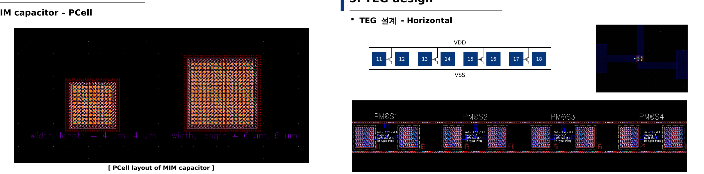
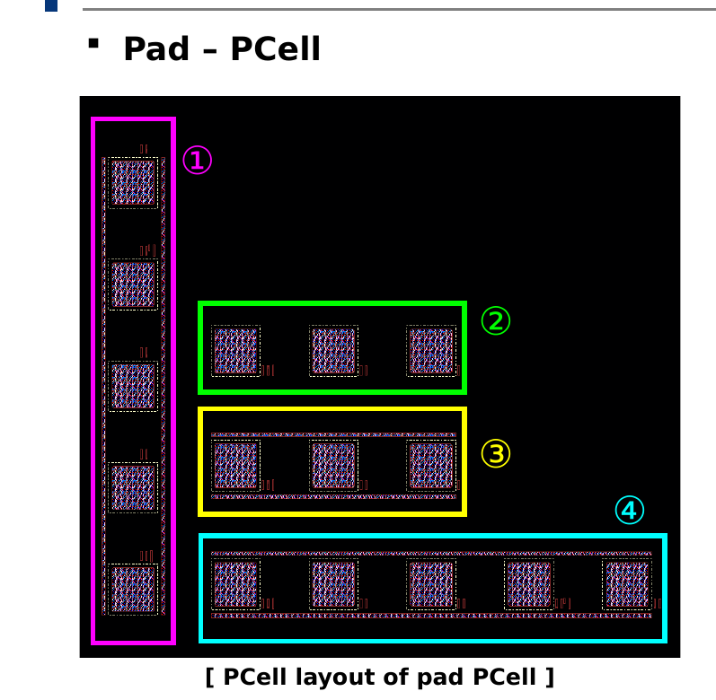

# Full Customed Digital IC Project: TEG Design using PCell

## 개요
PCell(Parameterized Cell)을 활용해 반도체 레이아웃을 자동화하고, TEG(Test Element Group)를 설계해 Process variation이 소자 전기적 특성에 미치는 영향을 분석한 프로젝트입니다.

- **수행기간**: 2025. 08. 14 ~ 09. 18
- **사용 기술**: Cadence Virtuoso, SKILL(PCell 코딩), GPDK 공정

## 담당 역할
MIM Capacitor, Pad PCell 설계, 발표자료 제작 및 발표

## 주요 구현 내용
### MIM Capacitor / TEG 설계
- Parameter(width/length) 입력에 따라 크기가 자동으로 변하는 MIM Capacitor PCell 구현
- 설계된 PCell들을 wafer scribe lane 규격에 맞춰 배치, VDD/VSS 공통 power line 구조로 TEG 완성

### Pad PCell 설계 (본인 담당)
direction에 따라 repeat 방향을 전환할 수 있는 Ultra PCell을 구현했습니다.

## 설계 고려사항 및 회고
PCell로 만들어두면 파라미터만 바꿔서 재사용할 수 있다는 점이 처음엔 낯설었는데, 직접 SKILL 코드로 만들어보며 레이아웃 자동화의 필요성을 체감할 수 있었습니다.
