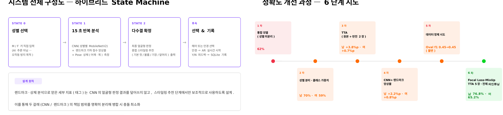
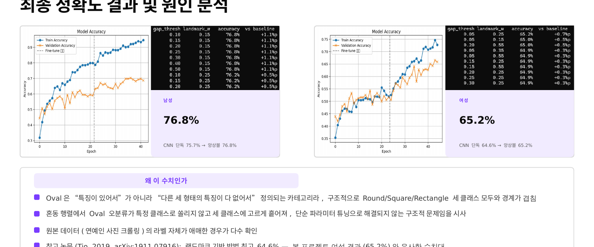

# CNN 기반 얼굴형 분석 및 스타일링 추천 시스템

## 개요
얼굴형에 따라 어울리는 헤어스타일과 안경이 다르다는 점은 널리 알려져 있으나, 본인의 얼굴형을 객관적으로 판단하기는 어렵다는 문제에서 출발한 프로젝트입니다. 얼굴형은 명확한 규칙으로 정의하기 어려워, 다수의 얼굴 이미지로부터 시각적 특징과 패턴을 학습하는 CNN이 얼굴형 판별에 적합하다고 판단해 CNN 기반 이미지 분류 모델을 적용했습니다. Jetson Nano 위에서 실시간으로 분석·추천·피드백까지 끝나는 완성형 임베디드 비전 시스템으로 구현했습니다.

- **수행기간**: 정확한 기간 미기재 (발표일: 2026. 07. 30 기준)
- **사용 기술**: Jetson Nano, TensorFlow 2.4.1(MobileNetV2 전이학습), OpenCV, MediaPipe(Face Mesh/Pose), PyQt5, SQLite

## 담당 역할
CNN 얼굴형 분류 모델 학습, 데이터 준비, 성능 개선(Focal Loss·MixUp·TTA), Jetson Nano 배포 검증 담당

## 프로젝트 목표
- **하이브리드 판정 구조 구현**: CNN 단독 판정이 애매한 경우, 랜드마크 기하학적 점수와의 앙상블로 보완하는 시스템 설계
- **오작동 리스크 최소화**: 성별처럼 AI가 잘못 추론하면 전체 결과가 틀어지는 요소는 사용자가 직접 지정(FSM)하도록 설계
- **임베디드 환경에서의 실동작**: Jetson Nano 위에서 실시간으로 분석·추천·피드백까지 끝나는 완성형 시스템 구현

## 주요 구현 내용

### 하이브리드 State Machine 구성
STATE0(성별 M/F 키 직접 입력, 오작동 방지) → STATE1(15초 반복 분석, CNN+랜드마크 앙상블+Pose 상체 측정) → STATE2(다수결 확정, 종합 스타일링 추천) → 헤어/안경 선택 → AR 시착 → Y/N 피드백 SQLite 기록으로 이어지는 구조입니다. 랜드마크·상체 분석 지표는 CNN의 얼굴형 판정 결과를 덮어쓰지 않고 스타일링 추천 단계에서만 보조적으로 사용하도록 역할을 분리했습니다.

### CNN 모델 설계 및 정확도 개선 (본인 담당)
- MobileNetV2 전이학습 기반 성별별 독립 모델(남/여 각각)로 Oval/Rectangle/Round/Square 4-class 분류
- 데이터셋: 남성 927장, 여성 3,200장 (Kaggle 계열 celebrity 데이터)
- 6단계 정확도 개선 과정:
  1. 통합 모델(성별 미분리) — 62%
  2. 성별 분리·클래스 가중치 — 남 70% · 여 59%
  3. TTA(Test-Time Augmentation, 원본+반전 2장)
  4. CNN+랜드마크 앙상블 — CNN이 확신하는 쉬운 케이스는 그대로 두고, 1등·2등 확률 차이가 작아 애매할 때만 랜드마크로 보정
  5. 데이터 정제 시도 — 효과는 없었지만 문제가 파라미터가 아닌 데이터 자체의 한계라는 단서를 얻음
  6. Focal Loss·MixUp·TTA 5장·전체 파인튜닝 — 최종 남 76.8% · 여 65.2% 달성

### 최종 결과 및 원인 분석
- 최종 정확도: 남성 76.8% (CNN 단독 75.7% → 앙상블 76.8%), 여성 65.2% (CNN 단독 64.6% → 앙상블 65.2%)
- Oval 클래스는 "특징이 있어서"가 아니라 "다른 세 형태의 특징이 다 없어서" 정의되는 카테고리라, 구조적으로 Round/Square/Rectangle 세 클래스 모두와 경계가 겹침을 혼동행렬로 확인
- 참고 논문(Tio, 2019, arXiv:1911.07916) 랜드마크 기반 방법 최고 64.6%와 본 프로젝트 여성 결과(65.2%)가 유사한 수치대로, 원본 데이터(연예인 사진 크롤링)의 라벨 자체가 애매한 경우가 다수 확인되어 데이터 라벨링 한계에 가깝다고 해석

### 랜드마크 분석 & AR 시착 (팀원 담당 영역)
MediaPipe FaceMesh로 얼굴 8개 기준점 좌표를 확보해 정량 비율을 계산하고, 복합 태그를 감지해 스타일링 문구를 생성합니다. 안경 AR 시착은 얼굴 너비 기준 자동 리사이즈, 고개 기울기 각도 계산 기반 회전 보정, 매 프레임 랜드마크 재검출을 통한 실시간 추적 기능을 포함합니다.

## 설계 고려사항 및 회고
- CNN이 이미 확신하는 쉬운 케이스는 그대로 두고, 1등·2등 확률 차이가 작아 애매할 때만 랜드마크로 보정하도록 설계해 앙상블의 부작용을 최소화했습니다.
- Jetson Nano 배포를 전제로 TensorFlow 2.4.1 환경에서 학습·검증을 진행해, PC(TF 2.15+)와의 버전 차이로 발생하는 레이어 임포트 이슈까지 고려해 모델 구조를 설계했습니다.
- 데이터 정제 시도가 효과 없었던 경험을 통해, 문제가 항상 파라미터 튜닝으로 풀리는 것은 아니고 데이터 자체의 한계일 수 있다는 것을 체감했습니다.

## 한계 및 향후 개선 방향
- 여성 클래스(특히 Oval) 정확도 한계(65.2%) — 과제 자체의 근본적 한계보다 데이터 라벨링 문제에 가깝다고 해석
- 얼굴형 판정과 스타일 추천은 객관적 정답이 없는 문제로, 참고용 가이드로 활용을 전제함
- 향후 웹 대시보드 버전 완성, 피드백(Y/N) 통계 기반 안경 추천 우선순위 조정, 헤어스타일도 안경처럼 실시간 AR 오버레이로 확장 예정
